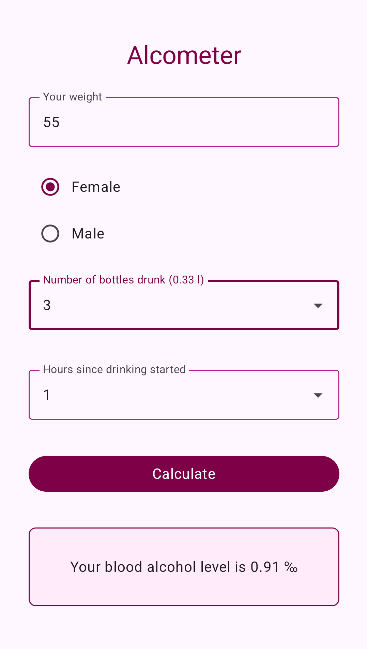
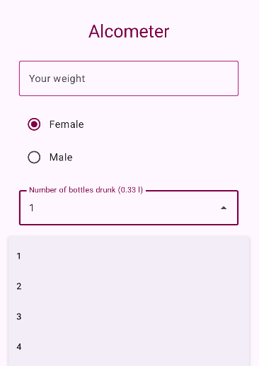
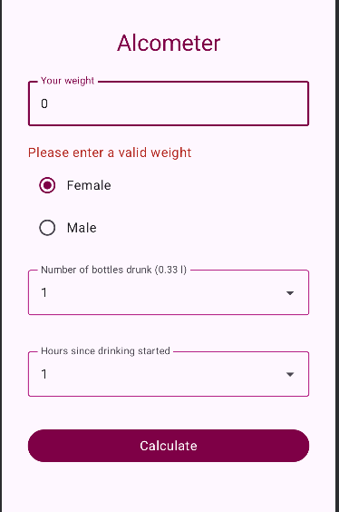
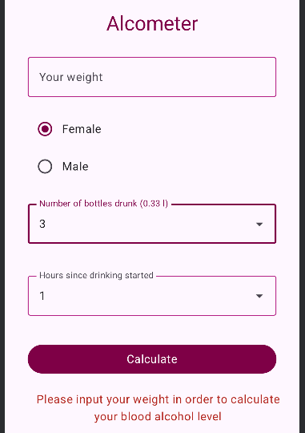

# Alcometer

Simple UI and calculator for estimating your blood alcohol level based on your weight, gender, number of bottles consumed and hours since drinking started. 
Implemented with **Kotlin** + **Jetpack Compose**.

## Screenshots

<table>
<tr>
    <td></td>
    <td></td>
    
</tr>
<tr>
    <td></td>
    <td></td>
</tr>
</table>


## Features

This project implements UI and logic for calculating blood alcohol level:

- Input field to enter your weight in kilograms
- Radio buttons to select gender (Female/Male)
- Dropdown menus to select number of bottles (0.33 l) and hours 
- Calculate button to perform the calculation
- Result displayed with the value in ‰ (promille)
- Error messages if weight value is missing or invalid (0 or negative)

## Implementation details

- `Column` layout to arrange elements vertically
- `OutlinedTextField` component for weight input with numeric keyboard type
- `RadioButtons` for gender selection, each aligned with its label in a row
- `ExposedDropdownMenuBox` for dropdown selections (dropdowns have default values)
(this is an **experimental** Material3 API so `@OptIn(ExperimentalMaterial3Api::class)` is used in the code) *
- `Button` component 
- `Box` component with border and rounded corners to display result
- Styling uses `modifiers` (padding, fillMaxWidth, border, background, RoundedCornerShape etc)
- `State variables` control input values, dropdown visibility, result and error display

 #### * Difference between normal DropdownMenu and ExposedDropdownMenuBox:

- ExposedDropdownMenuBox combines a text field and dropdown, so the user can click the text field to open the menu. 
It automatically provides a Material3-style trailing icon, alignment and highlights the selected item.
- With a normal DropdownMenu, developer controls the menu’s opening and positioning manually and it's not linked to a text field

## Running the app

This project was created using Android Studio. To clone and open the project:

```bash
- git clone https://github.com/Anniina-55/Alcometer.git
- cd Alcometer

- open and run the project in Android Studio
-> UI should render on emulator and connected physical devices


